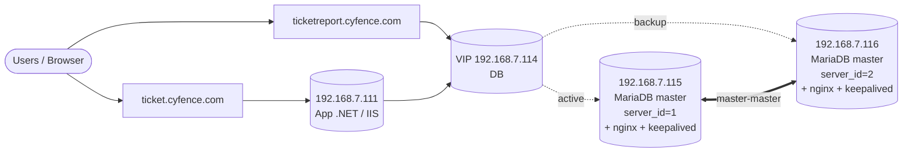
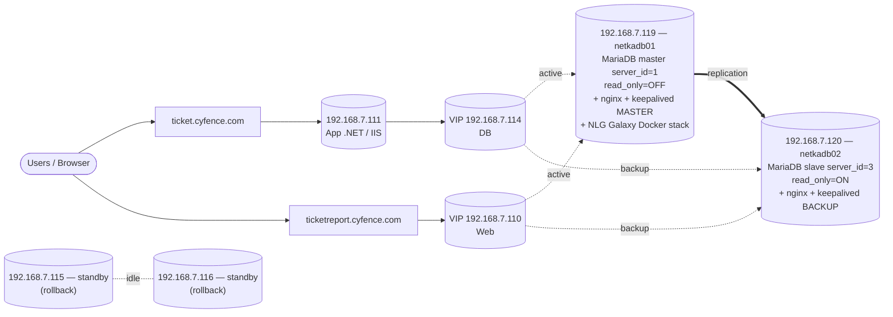
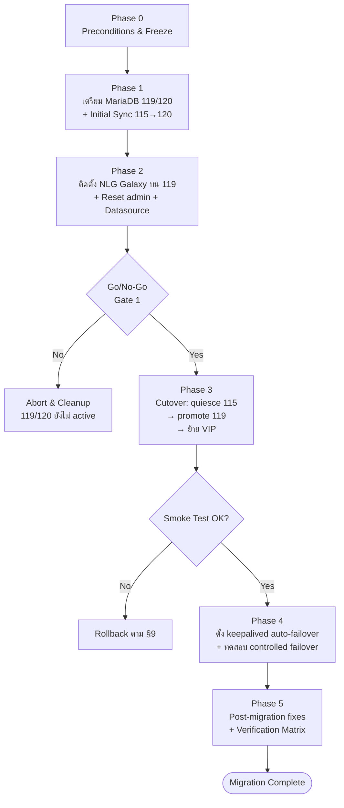
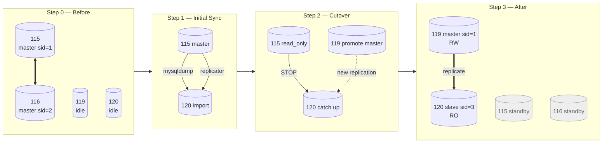
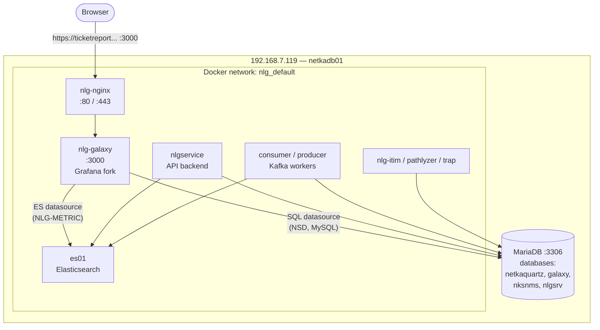
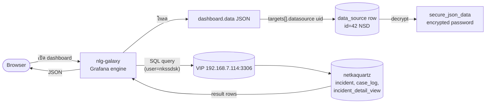

# คู่มือการทำ Migration: Netka Ticket + NLG Galaxy (115/116 → 119/120)

> **As-Built Migration Manual** — จัดทำหลังจากดำเนินการ migration จริงสำเร็จแล้ว
> เอกสารนี้สรุปขั้นตอนตามลำดับที่ทำจริง พร้อมปัญหาที่พบและวิธีแก้ เพื่อให้นำกลับไปใช้ซ้ำหรือใช้เป็น reference สำหรับ migration ครั้งถัดไป

## 0) Document Control

| ฟิลด์ | ค่า |
|---|---|
| Owner | Infra / DBA Team |
| ระบบ | Netka Ticket (NetkaQuartz) + NLG Galaxy + nksnms |
| สถานะ | As-Built (Completed) |
| Revision | 1.0 (2026-05-15) |
| ระยะเวลาดำเนินการจริง | ประมาณ 2 สัปดาห์ (เตรียม + cutover + post-fix) |
| เอกสารอ้างอิง | `Galaxy-Cutover-Runbook-115-116-to-119-120.md`, `MariaDB-HA-Manual.md`, `Nginx-Keepalived-HA-Manual.md`, `MariaDB-Restore-Runbook-ISO27001.md` |

---

## 1) ภาพรวม Migration

### 1.1 วัตถุประสงค์

ย้าย production workload ของระบบ Netka Ticket และ NLG Galaxy จากเครื่องเดิม `115/116` (MariaDB master-master + Web HA) ไปยังเครื่องใหม่ `119/120` แบบลด downtime ให้น้อยที่สุด พร้อมความสามารถ rollback กลับได้ทันที

### 1.2 Scope

- ระบบ Web: `ticket.cyfence.com/netkaquartz` (.NET app บน 111)
- ระบบ Report: `ticketreport.cyfence.com:3000` (NLG Galaxy/Grafana fork)
- ระบบ DB: MariaDB 10.11 (`netkaquartz`, `galaxy`, `nksnms`, `nlgsrv`)
- ระบบ NLG Galaxy: Docker containers บน 119 (`nlg-galaxy`, `nlgservice`, `mariadb`, `es01`, ...)
- HA: keepalived VIPs (`192.168.7.114` = DB, `192.168.7.110` = Web)

### 1.3 Topology — Before / After

**Before (Production เดิม)**



**After (Production ใหม่)**



### 1.4 Server / Credential Inventory

| Server | IP | Role | OS | User SSH |
|---|---|---|---|---|
| netkaweb01 | 111 | App .NET (IIS) | Windows | - |
| netkaweb02 | 112 | App .NET (backup) | Windows | - |
| netka115 | 115 | Legacy DB master + Web | Ubuntu | netka |
| netka116 | 116 | Legacy DB master + Web | Ubuntu | netka |
| netkadb01 | 119 | DB master + NLG Galaxy | Ubuntu 24.04 | yotpet |
| netkadb02 | 120 | DB slave + Web HA backup | Ubuntu 24.04 | yotpet |

| VIP | ใช้สำหรับ | บนเครื่อง |
|---|---|---|
| 192.168.7.110 | Web (nginx) | 119 (master) / 120 (backup) |
| 192.168.7.114 | DB (MariaDB) | 119 (master) / 120 (backup) |

| Credential | Username | หมายเหตุ |
|---|---|---|
| MariaDB root | root | ใช้ socket auth (sudo mysql) |
| App DB user | nkssdsk | password = `Ay2!BGur8` |
| Replication | replicator | password = `Repl!cat0r2026` |
| NLG DB user | nksglx | สำหรับ container ฝั่ง NLG |
| NLG Galaxy admin | admin | password = `Nlg2026xReset` (รีเซ็ตหลัง migrate) |

### 1.5 Migration Phase Flow



### 1.6 Replication Topology Transition



### 1.7 Cutover Window Timeline (อ้างอิง)

```mermaid
gantt
    title Cutover Maintenance Window (~2 ชั่วโมง)
    dateFormat HH:mm
    axisFormat %H:%M
    section เตรียม
    Pre-checks & ประกาศ          :done, prep, 22:00, 30m
    section Quiesce
    Stop App pool บน 111         :active, q1, 22:30, 5m
    115 read_only + lock         :active, q2, after q1, 5m
    Wait 120 catch-up            :active, q3, after q2, 10m
    section Switch
    Promote 119 + change master  :crit, sw1, after q3, 10m
    ย้าย VIP (keepalived)        :crit, sw2, after sw1, 5m
    Start App pool               :crit, sw3, after sw2, 5m
    section Verify
    Smoke test (web + report)    :ver, after sw3, 30m
    section Stabilize
    Monitor + log review         :mon, after ver, 30m
```



---

## 2) Pre-Migration Checklist

ก่อนเริ่ม migration จริง **ต้อง** ผ่านทุกข้อนี้:

- [ ] SSH เข้าได้ทุกเครื่อง (115, 116, 119, 120, 111)
- [ ] เครื่องใหม่ 119/120 ติดตั้ง MariaDB 10.11 + nginx + keepalived เรียบร้อย
- [ ] Network reachable ระหว่าง 119↔120↔115↔116↔111 (port 3306, 80, 443)
- [ ] DNS ของ `ticket.cyfence.com`, `ticketreport.cyfence.com` ชี้ที่ VIP 114 (พร้อม TTL ต่ำ)
- [ ] SSL wildcard cert `*.cyfence.com` พร้อมใช้ ทั้งบน 115/116/119/120
- [ ] ทำ full backup ของ 115 (`netkaquartz`, `galaxy`) เก็บไว้สำเร็จ
- [ ] War-room channel เปิด, ทีมพร้อม (Infra, DBA, App owner)
- [ ] Rollback plan ทดสอบแล้ว (ดูข้อ 9)
- [ ] Maintenance window ประกาศแล้ว

---

## 3) Phase 1 — เตรียมเครื่องใหม่ (119/120)

### 3.1 ตั้งค่า MariaDB บน 119 (จะเป็น master ใหม่)

ไฟล์: `/etc/mysql/mariadb.conf.d/50-server.cnf`

```ini
[mysqld]
server_id        = 1
log_bin          = /var/log/mysql/mariadb-bin
binlog_format    = ROW
expire_logs_days = 7
read_only        = 0
bind-address     = 0.0.0.0
```

```bash
sudo systemctl restart mariadb
sudo mysql -e "SHOW VARIABLES LIKE 'server_id'; SHOW VARIABLES LIKE 'binlog_format'; SHOW MASTER STATUS;"
```

### 3.2 ตั้งค่า MariaDB บน 120 (จะเป็น slave)

ไฟล์: `/etc/mysql/mariadb.conf.d/50-server.cnf`

```ini
[mysqld]
server_id        = 3                # ห้ามซ้ำกับ 115(=1) หรือ 116(=2)
log_bin          = /var/log/mysql/mariadb-bin
binlog_format    = ROW              # ต้องตรงกับ 115/119
relay_log        = /var/log/mysql/mariadb-relay
read_only        = 1
bind-address     = 0.0.0.0
```

```bash
sudo systemctl restart mariadb
```

> **บทเรียนสำคัญ:** ถ้าตั้ง `server_id=2` จะชนกับ 116 ทำให้ replication วนลูป
> และถ้า `binlog_format` เป็น `MIXED` (ค่า default) จะไม่สอดคล้องกับ 115 ที่เป็น `ROW`

### 3.3 สร้าง replication user (บน 115 ก่อน — ต้นทาง)

```sql
CREATE USER IF NOT EXISTS 'replicator'@'%' IDENTIFIED BY 'Repl!cat0r2026';
GRANT REPLICATION SLAVE ON *.* TO 'replicator'@'%';
FLUSH PRIVILEGES;
```

ตรวจจาก 120 ว่าล็อกอินมาที่ 115 ได้:

```bash
ssh yotpet@192.168.7.120 'MYSQL_PWD="Repl!cat0r2026" mysql -ureplicator -h192.168.7.115 -e "SELECT 1"'
```

### 3.4 Initial Sync — Dump 115 → Import 120

```bash
# บน 115: dump พร้อม master coordinates (รัน local เพื่อหลีกเลี่ยง connection drop)
ssh netka@192.168.7.115 \
  "MYSQL_PWD='cyF3nec3DB$' mysqldump -uroot \
   --single-transaction --quick --routines --triggers --events \
   --master-data=2 \
   --databases netkaquartz galaxy > /tmp/full_115_to_120.sql"

# บันทึก binlog position
ssh netka@192.168.7.115 \
  "grep -m1 'CHANGE MASTER TO MASTER_LOG_FILE' /tmp/full_115_to_120.sql"
# ตัวอย่าง: MASTER_LOG_FILE='mariadb-bin.000956', MASTER_LOG_POS=803019934

# โอนไป 120
scp netka@192.168.7.115:/tmp/full_115_to_120.sql yotpet@192.168.7.120:/tmp/

# Import บน 120
ssh yotpet@192.168.7.120 'sudo mysql < /tmp/full_115_to_120.sql'
```

> **บทเรียน:** ห้ามใช้ `mysqldump -h 192.168.7.115` ข้ามเครื่องโดยตรงสำหรับ DB ขนาด 5GB+ เพราะมักหลุดกลางทาง (`Lost connection`)

### 3.5 ตั้ง 120 เป็น slave ของ 115 (ชั่วคราวระหว่าง migrate)

```sql
STOP SLAVE;
RESET SLAVE ALL;
CHANGE MASTER TO
  MASTER_HOST='192.168.7.115',
  MASTER_USER='replicator',
  MASTER_PASSWORD='Repl!cat0r2026',
  MASTER_PORT=3306,
  MASTER_LOG_FILE='mariadb-bin.000956',
  MASTER_LOG_POS=803019934;
START SLAVE;
SHOW SLAVE STATUS\G
```

ต้องเห็น:
- `Slave_IO_Running: Yes`
- `Slave_SQL_Running: Yes`
- `Seconds_Behind_Master: 0`
- `Last_IO_Error / Last_SQL_Error` ว่าง

### 3.6 Verify Data Integrity

ใช้ `CHECKSUM TABLE` ทุก table แล้วเทียบ:

```bash
# บน 115
ssh netka@192.168.7.115 \
  'MYSQL_PWD="cyF3nec3DB$" mysql -N -uroot -e \
   "SELECT table_schema,table_name FROM information_schema.tables \
    WHERE table_schema IN (\"netkaquartz\",\"galaxy\") AND table_type=\"BASE TABLE\" \
    ORDER BY 1,2" \
   | while read -r s t; do \
       MYSQL_PWD="cyF3nec3DB$" mysql -N -uroot \
         -e "CHECKSUM TABLE \`$s\`.\`$t\` QUICK"; \
     done' > chk_115.txt

# บน 120 (เหมือนกัน — เปลี่ยน user/host)
# จากนั้น diff
diff -u chk_115.txt chk_120.txt
```

ถ้ามี table หาย/เกิน หรือ checksum ต่างกัน → ทำ re-sync ใหม่ก่อน cutover

---

## 4) Phase 2 — ติดตั้ง NLG Galaxy บน 119

### 4.0 NLG Galaxy Stack Architecture



> Configs สำคัญ: `/opt/nlg/.env` (มี `MARIADB_IP`, `ELASTICSEARCH_IP`),
> `/opt/nlg/galaxy/conf/default.ini` (host = `192.168.7.119:3306`),
> `docker-compose-nlgservice.yml` ต้องมี `extra_hosts: mariadb:${MARIADB_IP}`

### 4.1 Docker Stack

ไฟล์ compose อยู่ที่ `/opt/nlg/`:
- `docker-compose.yml` (consumer/producer)
- `docker-compose-galaxy.yml`
- `docker-compose-nlgservice.yml`
- `docker-compose-nginx.yml`
- `docker-compose-mariadb.yml`
- `docker-compose-pathlyzer.yml`, `docker-compose-trap.yml`, `docker-compose-itim.yml`, ...

ไฟล์ env: `/opt/nlg/.env` (มี `MARIADB_IP`, `ELASTICSEARCH_IP`, ...)

### 4.2 Database สำหรับ NLG (สร้างบน MariaDB ของ 119)

```sql
CREATE DATABASE IF NOT EXISTS nksnms  CHARACTER SET utf8mb4 COLLATE utf8mb4_unicode_ci;
CREATE DATABASE IF NOT EXISTS galaxy  CHARACTER SET utf8mb4 COLLATE utf8mb4_unicode_ci;
CREATE DATABASE IF NOT EXISTS nlgsrv  CHARACTER SET utf8mb4 COLLATE utf8mb4_unicode_ci;

CREATE USER IF NOT EXISTS 'nksglx'@'%' IDENTIFIED BY '<password>';
GRANT ALL PRIVILEGES ON nksnms.*  TO 'nksglx'@'%';
GRANT ALL PRIVILEGES ON galaxy.*  TO 'nksglx'@'%';
GRANT ALL PRIVILEGES ON nlgsrv.*  TO 'nksglx'@'%';
FLUSH PRIVILEGES;
```

> **บทเรียนที่พบจริง:**
> 1. `nlg-galaxy` config (`/opt/nlg/galaxy/conf/default.ini`) ถูกตั้ง `host = 192.168.7.121:3306` (IP ของระบบ test) → ต้องแก้เป็น `192.168.7.119:3306`
> 2. `nlgservice` ใน `docker-compose-nlgservice.yml` ขาด `extra_hosts` สำหรับ `mariadb` ทำให้ resolve ไม่ได้ → ต้องเพิ่ม:
>    ```yaml
>    extra_hosts:
>      - "elasticsearch:${ELASTICSEARCH_IP}"
>      - "mariadb:${MARIADB_IP}"
>    ```
> 3. Database `nlgsrv` ไม่ถูกสร้างอัตโนมัติ → ต้อง `CREATE DATABASE` ก่อน start container

### 4.3 Start NLG Stack

```bash
cd /opt/nlg
sudo docker compose -f docker-compose-mariadb.yml up -d   # ถ้าใช้ container mariadb
sudo docker compose -f docker-compose-galaxy.yml up -d
sudo docker compose -f docker-compose-nlgservice.yml up -d
sudo docker compose -f docker-compose-nginx.yml up -d
sudo docker compose -f docker-compose.yml up -d            # consumer/producer

sudo docker ps --format 'table {{.Names}}\t{{.Status}}' | grep -v Up
# ทุก container ต้องเป็น Up (ไม่มี Restarting)
```

### 4.4 รีเซ็ต Galaxy admin password

ถ้าจำรหัสไม่ได้ ใช้ CLI ภายใน container:

```bash
sudo docker exec nlg-galaxy sh -lc \
  'printf %s "Nlg2026xReset" \
   | /usr/share/galaxy/bin/galaxy-cli \
       --homepath /usr/share/galaxy \
       --config /etc/galaxy/galaxy.ini \
       admin reset-admin-password --password-from-stdin'
```

ตรวจจาก DB:

```sql
USE nksnms;
SELECT id, login, email, is_admin, updated FROM user WHERE login='admin';
```

### 4.5 ตั้ง Datasource ของ Galaxy ให้ชี้ MariaDB จริง

ผ่าน Grafana API (ตัวอย่าง datasource id=42 ชื่อ NSD):

```bash
curl -ks -u admin:Nlg2026xReset -X PUT \
  "https://192.168.7.119:3000/api/datasources/42" \
  -H "Content-Type: application/json" \
  -d '{
    "id":42, "uid":"plJnuVtDz", "name":"NSD", "type":"mysql",
    "access":"proxy", "url":"192.168.7.114:3306",
    "user":"nkssdsk", "database":"netkaquartz",
    "jsonData":{"maxOpenConns":0,"maxIdleConns":2,"connMaxLifetime":14400},
    "secureJsonData":{"password":"Ay2!BGur8"}
  }'
sudo docker restart nlg-galaxy   # flush connection pool
```

> **บทเรียน:** Grafana ต้องส่ง password ใน `secureJsonData` (ไม่ใช่ `password` field ตรงๆ) — และต้อง restart container เพื่อ flush connection pool ที่ cache password เก่า

---

## 5) Phase 3 — Cutover (สลับ production จาก 115/116 → 119/120)

### 5.0 Cutover Sequence

```mermaid
sequenceDiagram
    autonumber
    participant Op as Operator
    participant App as 111 (App .NET)
    participant DB115 as 115 (old master)
    participant DB119 as 119 (new master)
    participant DB120 as 120 (new slave)
    participant KA as keepalived
    participant VIP as VIP 192.168.7.114

    Op->>App: Stop-WebAppPool netkaquartz
    Op->>DB115: FLUSH TABLES WITH READ LOCK<br/>SET GLOBAL read_only=ON
    Op->>DB120: SHOW SLAVE STATUS<br/>(รอ Seconds_Behind_Master = 0)
    DB115-->>DB120: replicate ครบ
    Op->>DB119: SET GLOBAL read_only=OFF<br/>(promote)
    Op->>DB120: STOP SLAVE; RESET SLAVE ALL<br/>CHANGE MASTER TO 119<br/>START SLAVE
    Op->>KA: restart keepalived (119/120)
    KA->>VIP: ย้าย VIP มา 119
    Op->>App: Start-WebAppPool (ชี้ DB = VIP 114)
    App->>VIP: connect → 119
    Op->>Op: Smoke Test (ticket + dashboard)
```

### 5.1 Pre-Cutover Verification

ทำในช่วง maintenance window:

- [ ] Replication 115 → 120 lag = 0 (`Seconds_Behind_Master: 0`)
- [ ] Backup ของ 115 ล่าสุด (ก่อน cutover)
- [ ] App connection string พร้อมเปลี่ยน (เป้าหมาย = VIP 114)
- [ ] DNS TTL ลดเป็น 60 วินาที (ทำล่วงหน้า ≥ 24 ชม.)

### 5.2 หยุด Write บน 115 (Quiesce)

```bash
# บน 115
ssh netka@192.168.7.115 'sudo mysql -e "FLUSH TABLES WITH READ LOCK; SET GLOBAL read_only=ON;"'
```

หยุด App pool บน 111 ชั่วครู่ (ลด traffic):
```powershell
# บน Windows 111
Stop-WebAppPool -Name "netkaquartz"
```

### 5.3 รอ slave 120 sync จบ

```bash
ssh yotpet@192.168.7.120 'sudo mysql -e "SHOW SLAVE STATUS\G"' \
  | egrep 'Seconds_Behind_Master|Read_Master_Log_Pos|Exec_Master_Log_Pos'
# ต้องได้: Seconds_Behind_Master = 0 และ Read = Exec
```

### 5.4 Promote 119 เป็น Master (เปลี่ยน slave ของ 120 มาเป็น 119)

```sql
-- บน 119: ทำให้พร้อมเป็น master
SET GLOBAL read_only=OFF;
SHOW MASTER STATUS;   -- จดค่า File, Position

-- บน 120: เปลี่ยน master จาก 115 → 119
STOP SLAVE;
RESET SLAVE ALL;
CHANGE MASTER TO
  MASTER_HOST='192.168.7.119',
  MASTER_USER='replicator',
  MASTER_PASSWORD='Repl!cat0r2026',
  MASTER_PORT=3306,
  MASTER_USE_GTID=slave_pos;
START SLAVE;
SHOW SLAVE STATUS\G
```

> **เงื่อนไข:** ต้องแน่ใจว่า 119 มีข้อมูลครบเท่ากับ 115 ก่อน เพราะ 119 จะกลายเป็น source-of-truth ใหม่

### 5.5 ย้าย VIP มาที่ 119/120

ตั้ง keepalived (ดูข้อ 6) ให้ 119 = MASTER (priority สูง) และ 120 = BACKUP

```bash
sudo systemctl restart keepalived
ip a | grep -E '192.168.7.110|192.168.7.114'   # ต้องเห็น VIP บน 119
```

### 5.6 เปลี่ยน App connection string → VIP 114

App บน 111 ต้องชี้ DB ไปที่ `192.168.7.114:3306` (ไม่ใช่ 115 ตรงๆ) — VIP จะวิ่งไป 119 อัตโนมัติ

```powershell
Start-WebAppPool -Name "netkaquartz"
```

### 5.7 Smoke Test

- [ ] เปิด `https://ticket.cyfence.com/netkaquartz/login.aspx` → login ได้
- [ ] สร้าง/แก้ไข ticket ทดสอบ
- [ ] เปิด `https://ticketreport.cyfence.com:3000/` → dashboard มีข้อมูล
- [ ] ตรวจ `nginx access.log` บน 119 มี request เข้ามาจริง
- [ ] ตรวจ slave บน 120 ยัง replicate จาก 119 ปกติ

---

## 6) Phase 4 — ตั้ง Auto-Failover (keepalived + scripts)

### 6.1 keepalived config — 119 (MASTER)

ไฟล์: `/etc/keepalived/keepalived.conf`

```conf
vrrp_script chk_mysql {
    script "/etc/keepalived/scripts/mysqlcheck.sh"
    interval 5
    weight -20
}

vrrp_script chk_web {
    script "/etc/keepalived/scripts/webcheck.sh"
    interval 5
    weight -20
}

vrrp_instance VI_DB {
    state MASTER
    interface ens33
    virtual_router_id 51
    priority 102
    advert_int 1
    authentication { auth_type PASS  auth_pass <secret> }
    virtual_ipaddress { 192.168.7.114/24 }
    track_script { chk_mysql }
    notify_master "/etc/keepalived/scripts/ensure_master.sh"
}

vrrp_instance VI_WEB {
    state MASTER
    interface ens33
    virtual_router_id 52
    priority 202
    advert_int 1
    authentication { auth_type PASS  auth_pass <secret> }
    virtual_ipaddress { 192.168.7.110/24 }
    track_script { chk_web }
}
```

### 6.2 keepalived config — 120 (BACKUP)

```conf
vrrp_instance VI_DB {
    state BACKUP
    priority 92
    notify_master "/etc/keepalived/scripts/promote_master.sh"
    notify_backup "/etc/keepalived/scripts/demote_backup.sh"
    notify_fault  "/etc/keepalived/scripts/demote_backup.sh"
    # ... (อื่นๆ เหมือน 119)
}

vrrp_instance VI_WEB {
    state BACKUP
    priority 192
    # ...
}
```

### 6.3 Scripts (chmod 700, owner root:root)

| Script | บนเครื่อง | หน้าที่ |
|---|---|---|
| `/etc/keepalived/scripts/mysqlcheck.sh` | 119, 120 | check `systemctl is-active mariadb` + `pidof mariadbd` |
| `/etc/keepalived/scripts/webcheck.sh` | 119, 120 | check `systemctl is-active nginx` |
| `/etc/keepalived/scripts/ensure_master.sh` | 119 | `SET GLOBAL read_only=OFF` |
| `/etc/keepalived/scripts/promote_master.sh` | 120 | `STOP SLAVE; RESET SLAVE ALL; SET GLOBAL read_only=OFF` |
| `/etc/keepalived/scripts/demote_backup.sh` | 120 | `SET GLOBAL read_only=ON; CHANGE MASTER TO ... GTID; START SLAVE` |

ตัวอย่าง `mysqlcheck.sh`:

```bash
#!/bin/bash
systemctl is-active --quiet mariadb || exit 2
pidof mariadbd >/dev/null         || exit 2
exit 0
```

> **บทเรียน:** เวอร์ชันแรกใช้ `pidof mysqld` + `pidof java` ทำให้ check fail ตลอดบน MariaDB 10.11 (process ชื่อ `mariadbd`) — ต้องแก้ให้ตรง

ตัวอย่าง `promote_master.sh` (บน 120):

```bash
#!/bin/bash
LOG=/var/log/keepalived-db-failover.log
echo "$(date): notify_master triggered, promoting 120 to master" >> $LOG
mysql -e "STOP SLAVE; RESET SLAVE ALL; SET GLOBAL read_only=OFF;" 2>>$LOG
```

ตัวอย่าง `demote_backup.sh` (บน 120):

```bash
#!/bin/bash
LOG=/var/log/keepalived-db-failover.log
echo "$(date): notify_backup/fault, demoting 120 back to slave of 119" >> $LOG
mysql -e "SET GLOBAL read_only=ON;
  CHANGE MASTER TO
    MASTER_HOST='192.168.7.119',
    MASTER_USER='replicator',
    MASTER_PASSWORD='Repl!cat0r2026',
    MASTER_USE_GTID=slave_pos;
  START SLAVE;" 2>>$LOG
```

### 6.4 Verify keepalived

```bash
sudo systemctl restart keepalived
sudo journalctl -u keepalived -n 30 --no-pager | grep -E 'chk_|MASTER|BACKUP|VI_'
# 119: เห็น "Entering MASTER STATE" และ chk_mysql/chk_web succeeded
# 120: เห็น "Entering BACKUP STATE"

# ตรวจ VIP
ip -br addr | grep -E '110|114'   # บน 119 เท่านั้น
```

### 6.5 ทดสอบ Failover แบบ controlled

#### Failover Sequence Diagram

```mermaid
sequenceDiagram
    autonumber
    participant DB119 as 119 mariadb
    participant KA119 as keepalived@119
    participant KA120 as keepalived@120
    participant DB120 as 120 mariadb
    participant VIP as VIP 114

    Note over DB119: mariadb stop (จำลองเครื่องล่ม)
    KA119->>KA119: chk_mysql.sh exit 2<br/>priority 102 → 82
    KA119--xKA120: VRRP advert หยุด/ต่ำกว่า
    KA120->>KA120: Entering MASTER STATE<br/>(notify_master)
    KA120->>DB120: STOP SLAVE; RESET SLAVE ALL<br/>SET GLOBAL read_only=OFF
    KA120->>VIP: ผูก VIP 114 มา 120
    Note over DB120: 120 รับ traffic แทน 119

    Note over DB119: ฟื้น: systemctl start mariadb
    KA119->>KA119: chk_mysql ok → priority กลับ 102<br/>preempt
    KA119->>KA120: ส่ง VRRP สูงกว่า
    KA120->>KA120: Entering BACKUP STATE<br/>(notify_backup)
    KA120->>DB120: SET GLOBAL read_only=ON<br/>CHANGE MASTER TO 119<br/>START SLAVE
    KA119->>VIP: VIP 114 กลับมา 119
    Note over DB119,DB120: ระบบกลับสู่สภาพ steady-state
```

#### คำสั่งทดสอบ

```bash
# จำลอง 119 ล่ม
ssh yotpet@192.168.7.119 'sudo systemctl stop mariadb'
sleep 10

# ตรวจ VIP 114 ย้ายมา 120
ssh yotpet@192.168.7.120 'ip -br addr | grep 114'
ssh yotpet@192.168.7.120 'sudo cat /var/log/keepalived-db-failover.log | tail -5'

# กู้กลับ
ssh yotpet@192.168.7.119 'sudo systemctl start mariadb'
# 119 มี priority สูงกว่า → preempt VIP กลับ
# 120 ต้อง demote กลับเป็น slave อัตโนมัติ
```

---

## 7) Phase 5 — Post-Migration Fixes (สิ่งที่พบจริง)

### 7.1 Application: "Could not connect to database"

**สาเหตุ:** Password ของ `nkssdsk` ถูกเปลี่ยนช่วง troubleshoot dashboard ทำให้ App เดิมใช้รหัสไม่ตรง

**แก้:**
```sql
ALTER USER 'nkssdsk'@'%' IDENTIFIED BY 'Ay2!BGur8';
FLUSH PRIVILEGES;
```
แล้วอัปเดต Galaxy datasource ให้ใช้ password เดียวกัน (ดูข้อ 4.5)

### 7.2 Galaxy Dashboard "No data"

**สาเหตุที่พบ:**
1. Panel format = `time_series` แต่ panel เป็น graph ที่ต้องการ table
2. `xaxis.values` = `["current"]` ทำให้ไม่ aggregate
3. Datasource password ว่างเปล่าหลังเปลี่ยน

**แก้:**
- Panel: set `targets[].format = "table"` และ `xaxis.values = ["total"]`
- Datasource: PUT password ใหม่ผ่าน API → restart container

ดูตัวอย่างสคริปต์ที่ใช้จริงใน `fix_rulename_dashboard.py`, `fix_panel18.pl`, ฯลฯ

### 7.3 nginx ไม่มี vhost `ticketreport.cyfence.com`

**ปัจจุบัน:** ทุก request เข้า default server แล้ว redirect ไป `ticket.cyfence.com/netkaquartz` — SSL ผ่านได้เพราะใช้ wildcard cert

ถ้าต้องการ explicit vhost ให้เพิ่มใน `/etc/nginx/conf.d/ticketreport.conf`:

```nginx
server {
    listen 443 ssl http2;
    server_name ticketreport.cyfence.com;
    ssl_certificate     /etc/nginx/ssl/cyfence.com.crt;
    ssl_certificate_key /etc/nginx/ssl/cyfence.com.key;

    location / {
        proxy_pass https://127.0.0.1:3000;
        proxy_set_header Host $host;
        proxy_set_header X-Real-IP $remote_addr;
        proxy_set_header X-Forwarded-Proto https;
    }
}
```

### 7.4 Replication Drift หลัง Cutover

หลัง cutover พบว่า data บน 120 ไม่ตรงกับ 115 100% (มีตารางหาย/เกิน + row count ต่าง) เพราะ:
1. 115 มีตาราง `_bk*` ที่ไม่ replicate
2. 120 มีตารางที่สร้างจาก app ก่อน sync

**วิธีจัดการ:**
- Tables ที่ใช้งานหลัก (case_log, incident, user) ตรงกัน → OK
- Tables backup (`*_bk20260309`) ไม่ replicate ตามนโยบาย → acceptable
- ทำ full re-sync ใหม่ถ้าต้องการ 100% match (ดู `MariaDB-Restore-Runbook-ISO27001.md`)

---

## 8) Verification Matrix (ทำตรวจหลัง Migration)

| รายการตรวจ | คำสั่ง | ค่าที่คาดหวัง |
|---|---|---|
| MariaDB 119 active | `systemctl is-active mariadb` (บน 119) | active |
| MariaDB 120 active | `systemctl is-active mariadb` (บน 120) | active |
| 119 = master, writable | `mysql -e "SELECT @@server_id, @@read_only"` | 1, 0 |
| 120 = slave, read-only | `mysql -e "SELECT @@server_id, @@read_only"` | 3, 1 |
| Slave running | `mysql -e "SHOW SLAVE STATUS\G"` | IO=Yes, SQL=Yes, Lag=0 |
| VIP DB บน 119 | `ip a \| grep 192.168.7.114` | พบ |
| VIP Web บน 119 | `ip a \| grep 192.168.7.110` | พบ |
| keepalived 119 | `journalctl -u keepalived` | "Entering MASTER STATE" |
| keepalived 120 | `journalctl -u keepalived` | "Entering BACKUP STATE" |
| nginx config OK | `nginx -t` | syntax is ok / test successful |
| App login | เปิดเว็บ ticket.cyfence.com | login ได้ |
| Galaxy login | https://ticketreport.cyfence.com:3000 | login ด้วย admin/Nlg2026xReset |
| Galaxy dashboard | เปิด dashboard หลัก | มีข้อมูล (ไม่ "No data") |
| Docker stack 119 | `docker ps` | ทุก container Up (ไม่มี Restarting) |

---

## 9) Rollback Plan

ถ้า cutover ล้มเหลว ให้ทำตามลำดับ:

### 9.1 Quick Rollback (< 5 นาที — ภายใน Phase 3)

```bash
# 1. หยุด keepalived บน 119/120 → VIP จะ release
ssh yotpet@192.168.7.119 'sudo systemctl stop keepalived'
ssh yotpet@192.168.7.120 'sudo systemctl stop keepalived'

# 2. กู้ keepalived เก่าบน 115/116 → VIP กลับมา
ssh netka@192.168.7.115 'sudo systemctl start keepalived'
ssh netka@192.168.7.116 'sudo systemctl start keepalived'

# 3. ปลด lock บน 115
ssh netka@192.168.7.115 'sudo mysql -e "SET GLOBAL read_only=OFF; UNLOCK TABLES;"'

# 4. App ยังใช้ VIP 114 เหมือนเดิม → ไม่ต้องแก้ connection string
```

### 9.2 Full Rollback (> 5 นาที — มีการเขียนข้อมูลบน 119 แล้ว)

ต้อง replay binlog จาก 119 กลับไป 115:

```bash
# Capture binlog ใหม่บน 119
mysqlbinlog --start-position=<pos_at_cutover> /var/log/mysql/mariadb-bin.* > /tmp/replay.sql

# Apply บน 115
mysql -uroot -p < /tmp/replay.sql
```

จากนั้นทำ 9.1

---

## 10) บทเรียน (Lessons Learned)

| # | ปัญหาที่พบ | สาเหตุ | วิธีป้องกันครั้งต่อไป |
|---|---|---|---|
| 1 | mysqldump ข้ามเครื่องหลุด | DB 5GB+ + network unstable | ทำ dump local ก่อนแล้วค่อย scp |
| 2 | Replication วนลูป | server_id ซ้ำ | จัดทำ server_id registry |
| 3 | binlog_format ไม่ตรง | default = MIXED | ตั้ง ROW ใน config ก่อนเปิด replication |
| 4 | Galaxy ชี้ DB ผิด IP | config ลอกจาก test environment (121) | grep `121` ใน config ทุกไฟล์ก่อน start |
| 5 | nlgservice DNS fail | ขาด extra_hosts | ตรวจ docker-compose ทุกไฟล์ก่อน deploy |
| 6 | nlgsrv DB ไม่มี | ไม่ได้สร้างล่วงหน้า | สร้าง DB ทั้งหมดใน checklist |
| 7 | nkssdsk password mismatch | เปลี่ยนรหัสตอน fix dashboard | ห้ามเปลี่ยน production credential ระหว่าง troubleshoot |
| 8 | mysqlcheck.sh ใช้ pidof mysqld | MariaDB 10.11 ใช้ชื่อ mariadbd | ใช้ `systemctl is-active mariadb` แทน |
| 9 | Dashboard "No data" | format / xaxis.values ผิด | บันทึก standard panel template |
| 10 | keepalived dir owner ผิด | ติดตั้งด้วย user ปกติ | ตั้ง chown root:root /etc/keepalived |
| 11 | DNS TTL สูง | ไม่ได้ลดล่วงหน้า | ลด TTL = 60s อย่างน้อย 24 ชม. ก่อน cutover |
| 12 | Galaxy datasource password ไม่ save | ใช้ field `password` แทน `secureJsonData` | ใช้ `secureJsonData.password` เสมอ + restart container |

---

## 10A) Database Schema (ER Diagram)

> **ที่มาของ schema:** ดึงจาก `information_schema.COLUMNS` ของ DB จริงบน 192.168.7.119 (master หลัง migration)
> **หมายเหตุสำคัญ:** Database `netkaquartz` ใช้ engine **MyISAM** (332 tables) + InnoDB (58 tables) แบบผสม — **ไม่มี FOREIGN KEY constraint ระดับ DB** ทุก relationship อาศัย naming convention `<table>_id` และจัดการ integrity ที่ application layer (.NET) ไดอะแกรมด้านล่างจึงเป็น **inferred ER** จากโครงสร้างคอลัมน์จริงที่ตรวจในระบบ

### 10A.1 ER — Core Ticket Entities

```mermaid
erDiagram
    customer ||--o{ contract            : "ลูกค้ามีสัญญา"
    customer ||--o{ customer_contact    : "มีผู้ติดต่อ"
    customer_type ||--o{ customer       : "จัดประเภท"
    contract ||--o{ asset               : "ครอบคลุม asset"
    contract ||--o{ incident            : "ภายใต้สัญญา"

    incident }o--|| case_type           : "ประเภท case"
    incident }o--|| case_status         : "สถานะ"
    incident }o--|| case_sub_category   : "หมวดย่อย"
    incident }o--|| priority            : "priority"
    incident }o--|| service_type        : "service type"
    incident }o--|| team                : "ทีม"
    incident }o--|| user                : "engineer/operator"
    incident ||--o{ case_log            : "log/ประวัติ"
    incident ||--o{ case_asset          : "ผูก asset"
    incident ||--o{ incident_work       : "งานย่อย"
    incident ||--o| incident_pending    : "pending"
    incident ||--o| incident_resolved   : "resolved"
    incident ||--o| incident_data_loss  : "data-loss"
    incident ||--o{ incident_change     : "change"
    incident ||--o{ incident_circuit    : "circuit"
    incident ||--o| incident_custom     : "custom fields"
    incident ||--o{ incident_case_type_custom : "extra case_type"

    case_log }o--|| case_log_type       : "ชนิด log"
    case_log }o--|| case_log_category   : "หมวด log"
    case_log ||--o{ case_attachment     : "เอกสารแนบ"

    case_type ||--o{ case_category      : "หมวดของ type"
    case_category ||--o{ case_sub_category : "หมวดย่อย"
    case_type ||--o{ service_cab        : "approval cab"
    case_type ||--o{ service_team       : "ทีมรับงาน"
    case_type ||--o{ incident_template  : "template"

    service_team }o--|| team            : "ทีม"
    service_type ||--o{ service_team    : "ประเภทบริการ"

    asset }o--|| asset_class            : "class"
    asset }o--|| asset_category         : "category"
    asset }o--|| asset_part             : "part type"
    asset }o--|| contract               : "อยู่ใน contract"
    asset ||--o{ asset_attribute_value  : "ค่า attribute"
    asset_attribute ||--o{ asset_attribute_value : "นิยาม"
    asset_class ||--o{ asset_category   : "มี category"

    user }o--|| user_control            : "สิทธิ์"
    team ||--o{ user                    : "สมาชิก (ผ่าน staff_id)"
    alarm_type ||--o{ alarm_description : "อธิบาย alarm"

    customer {
        int      customer_id PK "int(10) unsigned"
        int      customer_type_id FK
        int      sector_id FK
        string   customer_name
        string   status
    }
    customer_contact {
        int      customer_id PK_FK "composite"
        int      contact_id PK
        string   name
        string   email
        string   phone
    }
    customer_type {
        int      customer_type_id PK
        string   type_name
    }
    contract {
        int      contract_id PK "int(10) unsigned"
        int      customer_id FK
        int      sla_id FK
        int      email_profile_id FK
        int      sale_id FK
        date     start_date
        date     expire_date
        string   status
    }
    incident {
        int      id PK "auto_increment"
        string   case_id UK "varchar(45) — ใช้เป็น business key"
        int      contract_id FK
        int      case_type_id FK
        int      case_status_id FK
        int      case_sub_category_id FK
        int      priority_id FK
        int      tier_id FK
        int      service_type_id FK
        int      team_id FK
        int      operator_id FK "user/staff"
        int      engineer_id FK "user/staff"
        int      contact_id FK
        int      contact_channel_id FK
        int      symptom_type_id FK
        int      site_id FK
        int      location_id FK
        int      sd_id FK "service desk"
        int      staff_id FK
        int      closure_type_id FK
        int      resolution_type_id FK
        int      parent_case_id FK "self-ref"
        int      rfc_id FK
        int      problem_id FK
        string   customer_case_id
        string   vendor_case_id
        datetime created_date
        datetime resolved_date
        text     description
    }
    incident_pending {
        int      id PK
        int      case_id FK "→ incident.id"
        datetime pending_start
        datetime pending_end
        text     reason
    }
    incident_resolved {
        int      id "snapshot ของ incident ตอน resolve"
        string   case_id "varchar(45) — same shape as incident"
        int      case_status_id
        int      resolution_type_id
        datetime resolved_date
    }
    incident_work {
        int      case_id FK "int(11) — งานย่อยภายใต้ case"
        datetime work_start
        datetime work_end
        text     work_detail
    }
    incident_change {
        int      id PK
        int      incident_id FK
        int      change_id FK
    }
    incident_circuit {
        int      case_id FK
        string   circuit_id "varchar(45)"
    }
    incident_template {
        int      id PK
        int      case_type_id FK
        int      case_category_id FK
        int      case_sub_category_id FK
        int      priority_id FK
        int      tier_id FK
        int      impact_id FK
        int      urgency_id FK
        int      symptom_type_id FK
        int      site_id FK
    }
    incident_case_type_custom {
        int      case_id PK_FK "→ incident.id"
        int      case_type_id FK
    }
    incident_data_loss {
        int      id PK
        string   case_id FK "varchar(45) — เก็บเหมือน incident"
    }
    case_log {
        int      case_log_id PK "auto_increment"
        int      case_id FK "→ incident.id"
        int      case_log_type_id FK
        int      case_log_category_id FK
        datetime log_date
        text     detail
    }
    case_log_type {
        int      case_log_type_id PK
        string   type_name
    }
    case_log_category {
        int      case_log_category_id PK
        string   category_name
    }
    case_attachment {
        int      case_log_id PK_FK
        int      attachment_id PK
        string   filename
        string   filepath
    }
    case_asset {
        int      case_id PK_FK "composite"
        int      asset_id PK_FK
    }
    case_type {
        int      case_type_id PK "int(10) unsigned"
        string   case_type_name
    }
    case_status {
        int      case_status_id PK
        string   status_name
    }
    case_category {
        int      case_category_id PK
        int      case_type_id FK
        string   category_name
    }
    case_sub_category {
        int      case_sub_category_id PK
        int      case_category_id FK
        string   sub_name
    }
    priority {
        int      priority_id PK
        string   priority_name
    }
    priority_level {
        int      id PK
        int      impact_id FK
        int      urgency_id FK
        string   level_name
    }
    service_type {
        int      service_type_id PK
        string   service_name
    }
    service_team {
        int      case_type_id PK_FK "composite (ไม่มี surrogate)"
        int      team_id PK_FK
    }
    service_cab {
        int      case_type_id PK_FK
        int      cab_id PK_FK
    }
    team {
        int      team_id PK
        int      organization_id FK
        string   team_name
    }
    user {
        string   username PK "varchar(50) — ไม่ใช้ surrogate id"
        int     staff_id FK
        int     contact_id FK
        int     level_id FK
        string  user_line_id
    }
    user_control {
        string   username PK_FK "varchar(50) → user.username"
        text     permissions
    }
    asset {
        int      asset_id PK
        string   asset_code
        string   hostname
        string   ip
        string   serial_number
        int      asset_part_id FK
        int      asset_sub_category_id FK
        int      contract_id FK
        int      site_id FK
        int      staff_id FK
        int      office_id FK
        int      location_id FK
        int      item_status_id FK
        int      parent_id FK "self-ref"
        int      run_on_id FK "self-ref / OS host"
        int      supplier_contact_id FK
        date     start
        date     expire
    }
    asset_class {
        int      asset_class_id PK
        string   class_name
    }
    asset_category {
        int      asset_category_id PK
        int      asset_class_id FK
        string   category_name
    }
    asset_attribute {
        int      id PK
        int      control_type_id FK
        string   attribute_name
    }
    asset_attribute_value {
        int      asset_id PK_FK "composite"
        int      attribute_id PK_FK
        text     value
    }
    asset_part {
        int      id PK
        int      vendor_id FK
        int      asset_unit_id FK
        int      asset_part_image_id FK
        int      currency_id FK
    }
    alarm_type {
        int      alarm_type_id PK
        string   alarm_type_title
        string   alarm_type_description
    }
    alarm_description {
        int      id PK
        string   alarm
        string   description
    }
```

> **ข้อสังเกตสำคัญจาก schema จริง:**
> 1. **`incident.case_id` เป็น `varchar(45)`** ไม่ใช่ integer — ใช้เป็น business key (เช่น `INC2026050001`) ส่วน `incident.id` คือ surrogate key
> 2. **`incident_resolved`** มี structure เหมือน `incident` ทุกคอลัมน์ — เป็น **snapshot table** เก็บข้อมูลตอน case ปิด (history pattern)
> 3. **`incident_data_loss`** ก็เป็น snapshot โดเมนเฉพาะ (data-loss case)
> 4. **`incident_pending`** เก็บช่วงเวลาที่ case อยู่สถานะ pending (ใช้คำนวณ SLA)
> 5. **`user.username`** เป็น PK ตรงๆ (varchar) — ไม่มี `user_id` ทำให้ FK จาก `incident.engineer_id` / `operator_id` ไม่ได้ชี้ตรงที่ `user` แต่ชี้ที่ table `staff` (ไม่ได้แสดงในแผนภาพ)
> 6. **`service_team`, `service_cab`, `case_asset`, `incident_case_type_custom`** เป็น **junction table** (M:N) ไม่มี surrogate key
> 7. **`incident_template`** มี FK ครบหมดที่ `incident` มี → เป็น template สำหรับสร้าง case ใหม่

### 10A.2 ER — NLG Galaxy Storage (`nksnms`)

Galaxy เป็น Grafana fork ใช้ **InnoDB** ทั้งหมดและมี FK จริง

```mermaid
erDiagram
    org ||--o{ org_user        : "มีสมาชิก"
    user ||--o{ org_user       : "เป็นสมาชิก org"
    user ||--o{ user_auth      : "external login"
    user ||--o{ user_auth_token: "session token"
    user ||--o{ login_attempt  : "login history"

    org ||--o{ data_source     : "datasources"
    org ||--o{ dashboard       : "dashboards"
    org ||--o{ team
    org ||--o{ alert
    org ||--o{ playlist
    org ||--o{ annotation
    org ||--o{ api_key
    org ||--o{ quota
    org ||--o{ preferences

    team ||--o{ team_member    : "สมาชิกทีม"
    user ||--o{ team_member

    dashboard ||--o{ dashboard_version : "version history"
    dashboard ||--o{ dashboard_acl     : "permission"
    dashboard ||--o{ dashboard_tag     : "tag"
    dashboard ||--o{ star              : "ดาว"
    dashboard ||--o{ annotation        : "annotation"
    dashboard ||--o{ dashboard_provisioning : "as-code provisioning"
    dashboard ||--o{ dashboard_snapshot     : "snapshot"

    alert ||--o{ alert_notification_state : "state per channel"
    alert_notification ||--o{ alert_notification_state : "channel"
    alert ||--o{ alert_rule_tag

    playlist ||--o{ playlist_item

    org {
        bigint   id PK
        string   name UK
        string   address1
        datetime created
        datetime updated
    }
    user {
        bigint   id PK
        string   login UK "username"
        string   email UK
        string   password "salted+hashed"
        bool     is_admin
        bigint   org_id FK "primary org"
        datetime last_seen_at
    }
    org_user {
        bigint   id PK
        bigint   org_id FK
        bigint   user_id FK
        string   role "Admin/Editor/Viewer"
    }
    user_auth {
        bigint   id PK
        bigint   user_id FK
        string   auth_module "ldap/oauth/google/..."
        string   auth_id
    }
    user_auth_token {
        bigint   id PK
        bigint   user_id FK
        string   auth_token UK
        string   prev_auth_token
        bigint   created_at
        bigint   seen_at
    }
    data_source {
        bigint   id PK
        bigint   org_id FK
        string   name
        string   type "mysql/elasticsearch/..."
        string   url
        string   user
        string   database
        string   password "deprecated — ใช้ secure_json_data"
        text     json_data
        text     secure_json_data "encrypted — เก็บ password จริง"
        int      version
        bool     is_default
    }
    dashboard {
        bigint   id PK
        string   uid UK
        bigint   org_id FK
        string   title
        text     data "JSON spec"
        int      version
        bigint   folder_id FK "→ dashboard.id"
        bool     is_folder
        datetime created
        datetime updated
    }
    dashboard_version {
        bigint   id PK
        bigint   dashboard_id FK
        int      version
        int      parent_version
        text     data
        string   message
    }
    dashboard_acl {
        bigint   id PK
        bigint   dashboard_id FK
        bigint   user_id FK
        bigint   team_id FK
        int      permission
    }
    dashboard_tag {
        bigint   id PK
        bigint   dashboard_id FK
        string   term
    }
    dashboard_snapshot {
        bigint   id PK
        string   key UK
        bigint   dashboard_id FK
        bigint   org_id FK
        text     dashboard
        bigint   user_id FK
    }
    star {
        bigint   id PK
        bigint   user_id FK
        bigint   dashboard_id FK
    }
    annotation {
        bigint   id PK
        bigint   org_id FK
        bigint   dashboard_id FK
        bigint   user_id FK
        bigint   epoch
        text     text
        text     tags
    }
    alert {
        bigint   id PK
        bigint   org_id FK
        bigint   dashboard_id FK
        int      panel_id
        string   name
        int      state "ok/alerting/no_data/..."
        text     message
        text     settings
    }
    alert_notification {
        bigint   id PK
        bigint   org_id FK
        string   name
        string   type "email/slack/line/..."
        text     settings
    }
    alert_notification_state {
        bigint   id PK
        bigint   org_id FK
        bigint   alert_id FK
        bigint   notifier_id FK "→ alert_notification.id"
        string   state
    }
    team {
        bigint   id PK
        bigint   org_id FK
        string   name
        string   email
    }
    team_member {
        bigint   id PK
        bigint   org_id FK
        bigint   team_id FK
        bigint   user_id FK
    }
    playlist {
        bigint   id PK
        string   uid UK
        bigint   org_id FK
        string   name
        int      interval
    }
    playlist_item {
        bigint   id PK
        bigint   playlist_id FK
        string   type
        string   value
    }
    api_key {
        bigint   id PK
        bigint   org_id FK
        string   name
        string   key UK
        string   role
    }
```

### 10A.3 Data Flow — Dashboard Query Path



### 10A.4 Database / Table Mapping ที่ใช้จริง

| Database | Engine | ใช้โดย | ตารางหลัก |
|---|---|---|---|
| `netkaquartz` | MyISAM(332) + InnoDB(58) | App `.NET` ticket.cyfence.com | `incident`, `incident_pending/resolved/data_loss/work`, `case_log`, `case_asset`, `case_attachment`, `customer`, `contract`, `asset`, `user`, `team`, `service_team`, `priority`, `case_type`, `case_status` |
| `nksnms` | InnoDB | NLG Galaxy (Grafana) | `user`, `org`, `data_source`, `dashboard`, `dashboard_version`, `alert`, `alert_notification`, `team` |
| `galaxy` | InnoDB | Galaxy เวอร์ชันเก่า/legacy บน 115 | (mirror — เก็บไว้เพื่อ rollback) |
| `nlgsrv` | InnoDB | container `nlgservice` | tables ภายใน (auto-create ตอน start) |

### 10A.5 ไฟล์ Schema Dump (raw)

ไฟล์อ้างอิงสำหรับสร้าง ER:
- [fk_netkaquartz.tsv](fk_netkaquartz.tsv) — ผลการ query `KEY_COLUMN_USAGE` (พบว่าว่างเปล่า → ไม่มี FK constraint จริง)
- [cols.tsv](cols.tsv) — column dump ของ 39 tables หลัก (422 บรรทัด)
- [cols_keys.tsv](cols_keys.tsv) — เฉพาะ PK + คอลัมน์ลงท้าย `_id` (169 บรรทัด — ใช้ infer relationship)

สั่งดึงใหม่ได้ด้วย:

```bash
ssh yotpet@192.168.7.119 \
  'sudo mysql -N -B -e "
    SELECT table_name, column_name, column_type, column_key
    FROM information_schema.columns
    WHERE table_schema=\"netkaquartz\"
    ORDER BY table_name, ordinal_position"' \
  > netkaquartz_full_schema.tsv
```

---

## 11) ไฟล์อ้างอิงในโปรเจกต์

| ไฟล์ | วัตถุประสงค์ |
|---|---|
| `Galaxy-Cutover-Runbook-115-116-to-119-120.md` | Runbook ฉบับเต็ม (Rev 3) |
| `MariaDB-HA-Manual.md` | คู่มือ HA ของ MariaDB |
| `Nginx-Keepalived-HA-Manual.md` | คู่มือ HA ของ Web layer |
| `MariaDB-Restore-Runbook-ISO27001.md` | คู่มือ restore สำหรับ DR |
| `Migration-RockyLinux-MariaDB-Plan.md` | แผน migration OS (ถ้าใช้) |
| `setup_slave_120.sql` | SQL script ตั้ง 120 เป็น slave |
| `chk_115.txt`, `chk_120.txt` | ผล checksum verification |
| `fix_rulename_dashboard.py` | ตัวอย่างสคริปต์ fix dashboard panel |

---

## 12) Sign-Off

| บทบาท | ผู้รับผิดชอบ | วันที่ | ลายเซ็น |
|---|---|---|---|
| Infra Lead | | | |
| DBA Lead | | | |
| App Owner | | | |
| Operations Manager | | | |

---

**End of Manual**
